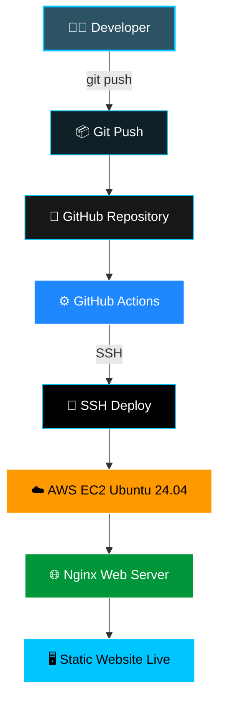
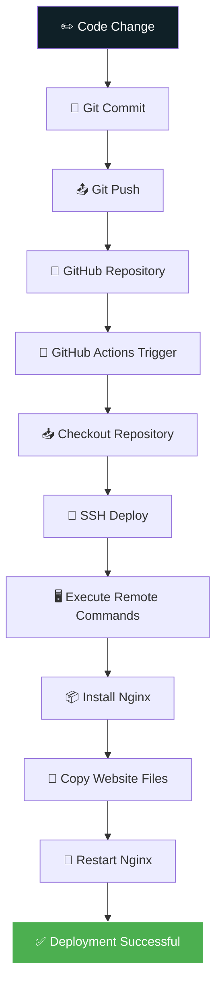
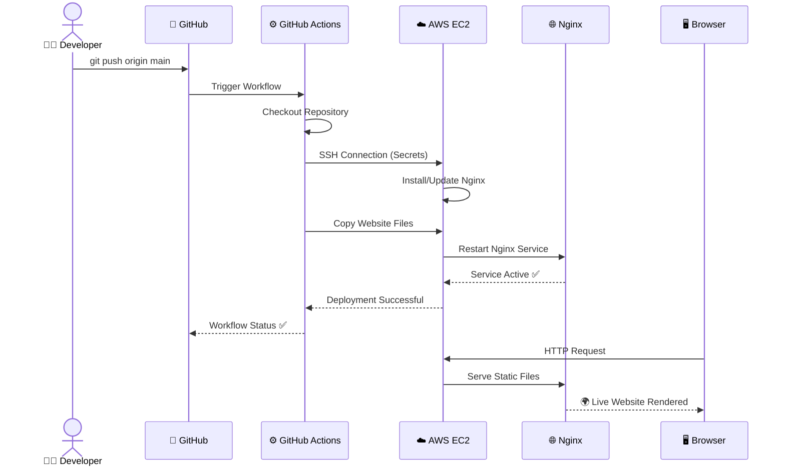
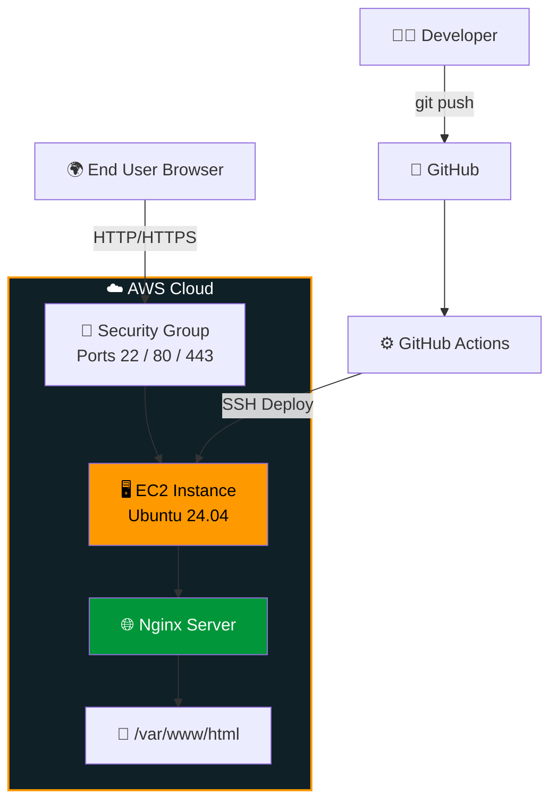

<div align="center">

<!-- Capsule Render Header -->


# 🚀 Hosting a Static Website on AWS EC2 using GitHub Actions CI/CD

### ⚡ Push Code → Auto Deploy → Live Website. No manual work. Ever.

<br/>


<br/>


</div>

<br/>

<div align="center">

</div>

---

## 📚 Table of Contents

- [📖 Project Overview](#-project-overview)
- [🎯 Objective](#-objective)
- [🛠️ Technologies Used](#️-technologies-used)
- [🏛️ Project Architecture](#️-project-architecture)
- [🔄 CI/CD Workflow Diagram](#-cicd-workflow-diagram)
- [📡 Deployment Pipeline (Sequence Diagram)](#-deployment-pipeline-sequence-diagram)
- [✨ Project Features](#-project-features)
- [📂 Folder Structure](#-folder-structure)
- [✅ Prerequisites](#-prerequisites)
- [🧭 Step-by-Step Guide](#-step-by-step-guide)
- [⚙️ GitHub Actions Workflow](#️-github-actions-workflow)
- [💻 Deployment Commands](#-deployment-commands)
- [🌐 Nginx Configuration](#-nginx-configuration)
- [🔁 Deployment Flow](#-deployment-flow)
- [🖼️ Screenshots](#️-screenshots)
- [🔐 Repository Secrets](#-repository-secrets)
- [🛡️ Security](#️-security)
- [☁️ AWS Architecture](#️-aws-architecture)
- [🌟 Advantages](#-advantages)
- [🎓 Learning Outcomes](#-learning-outcomes)
- [🐞 Common Errors](#-common-errors)
- [🩺 Troubleshooting](#-troubleshooting)
- [🚧 Future Improvements](#-future-improvements)
- [❓ FAQ](#-faq)
- [🤝 Contributing](#-contributing)
- [📄 License](#-license)
- [💬 Support](#-support)
- [📊 Repository Statistics](#-repository-statistics)
- [📬 Connect with Me](#-connect-with-me)

---

## 📖 Project Overview

This project demonstrates a **complete, production-style CI/CD pipeline** for automatically deploying a static website from **GitHub** to an **AWS EC2 Ubuntu Server**, using **GitHub Actions** and **Nginx**.

Every time code is pushed to the `main` branch, GitHub Actions automatically:

- 🔗 Connects securely to the EC2 instance via SSH
- 📦 Uploads the latest website files
- 🧩 Installs Nginx (if not already installed)
- 🔄 Restarts the web server
- 🌍 Deploys the latest version of the website — live, instantly

> 💡 **No manual deployment. No FTP. No copy-pasting files. Just `git push`.**

<div align="center">

| 🔥 Fully Automated | ☁️ Cloud Native | 🔒 Secure | ⚡ Fast |
|:---:|:---:|:---:|:---:|
| Push-to-deploy workflow | Hosted on AWS EC2 | SSH keys + GitHub Secrets | Deploys in seconds |

</div>

---

## 🎯 Objective

> Build a **production-like deployment pipeline** using **AWS Cloud** and **GitHub Actions** that automates static website deployment through **Continuous Integration and Continuous Deployment (CI/CD)** — eliminating manual server management and enabling rapid, reliable releases.

---

## 🛠️ Technologies Used

<div align="center">


</div>

---

## 🏛️ Project Architecture



---

## 🔄 CI/CD Workflow Diagram



---

## 📡 Deployment Pipeline (Sequence Diagram)



---

## ✨ Project Features

| Feature | Description |
|---|---|
| 🔄 **Automatic Deployment** | Every push to `main` triggers a full deployment |
| ⚙️ **GitHub Actions CI/CD** | Fully automated build & deploy pipeline |
| ☁️ **AWS EC2 Hosting** | Reliable, scalable cloud compute |
| 🐧 **Ubuntu Server** | Lightweight, stable Linux environment |
| 🌐 **Nginx Web Server** | High-performance static file serving |
| 🔐 **SSH Deployment** | Secure, encrypted remote execution |
| 🗂️ **Version Control** | Full history and rollback via Git |
| ☁️ **Cloud Hosting** | Publicly accessible, always-on website |
| 🧩 **Simple Architecture** | Easy to understand and extend |
| 📈 **Scalable** | Ready to grow into a larger infrastructure |
| 🎓 **Beginner Friendly** | Clear steps for newcomers to DevOps |
| 🏭 **Production Ready** | Mirrors real-world deployment patterns |
| ⚡ **Fast Deployment** | Deploys in seconds, not minutes |
| 🌍 **Open Source** | Free to use, fork, and modify |

---

## 📂 Folder Structure

```text
Hosting-a-Static-Website-on-AWS-EC2-using-GitHub-Actions-CI-CD/
│
├── .github/
│   └── workflows/
│       └── github-actions-ec2.yml     # CI/CD pipeline definition
│
├── index.html                          # Main website page
├── style.css                           # Website styling
├── script.js                           # Website interactivity
├── assets/                             # Images, icons, fonts
├── README.md                           # Project documentation
└── LICENSE                             # MIT License
```

---

## ✅ Prerequisites

Before you begin, make sure you have:

- ☁️ **AWS Account** (Free Tier is enough)
- 🐙 **GitHub Account**
- 🧰 **Git Installed** on your local machine
- 🖥️ **AWS EC2 Instance** provisioned
- 🐧 **Ubuntu Server 24.04** as the OS
- 🔑 **SSH Key Pair** (`.pem` file) for secure access
- 🌐 **Internet Connection**
- 📘 **Basic Linux Knowledge** (helpful, not mandatory)

---

## 🧭 Step-by-Step Guide

### 📍 Step 1 — Create GitHub Repository

Create a new public or private repository on GitHub to host your static website source code and workflow files.

> 🖼️ *Screenshot Placeholder: `assets/screenshots/01-create-repo.png`*

---

### 📍 Step 2 — Upload Website Code

Initialize Git locally and push your static website files to GitHub:

```bash
git init
git add .
git commit -m "Initial commit: static website files"
git branch -M main
git remote add origin https://github.com/yourusername/your-repo-name.git
git push -u origin main
```
---

### 📍 Step 3 — Launch AWS EC2

Launch a new EC2 instance with the following configuration:

| Setting | Value |
|---|---|
| **AMI** | Ubuntu Server 24.04 LTS |
| **Instance Type** | `t2.micro` (Free Tier eligible) |
| **Storage** | 8–20 GB gp3 |
| **Key Pair** | Create/download a new `.pem` key |
| **Security Group Inbound Rules** | Port `22` (SSH), `80` (HTTP), `443` (HTTPS) |

---

### 📍 Step 4 — Connect via SSH

Connect to your EC2 instance from your local terminal:

```bash
chmod 400 website-key.pem
ssh -i website-key.pem ubuntu@YOUR_PUBLIC_IP
```
---

### 📍 Step 5 — Configure GitHub Secrets

Navigate to **Settings → Secrets and variables → Actions** in your GitHub repository, and add the following secrets:

| 🔑 Secret Name | 📌 Purpose |
|---|---|
| `EC2_SSH_KEY` | Private SSH key (`.pem` contents) used to authenticate with EC2 |
| `HOST_DNS` | Public IP or DNS name of your EC2 instance |
| `USERNAME` | SSH login username (typically `ubuntu`) |
| `TARGET_DIR` | Destination directory on the server (e.g., `/var/www/html`) |

> ⚠️ **Never commit your `.pem` file or secrets to the repository.**

---

## ⚙️ GitHub Actions Workflow

Below is the complete CI/CD workflow file located at `.github/workflows/github-actions-ec2.yml`:

```yaml
name: Deploy Static Website to AWS EC2

on:
  push:
    branches:
      - main

jobs:
  deploy:
    name: 🚀 Deploy to EC2
    runs-on: ubuntu-latest

    steps:
      - name: 📥 Checkout Repository
        uses: actions/checkout@v4

      - name: 🔐 Deploy via SSH
        uses: appleboy/ssh-action@v1.0.3
        with:
          host: ${{ secrets.HOST_DNS }}
          username: ${{ secrets.USERNAME }}
          key: ${{ secrets.EC2_SSH_KEY }}
          script: |
            sudo apt update -y
            sudo apt install nginx -y
            sudo systemctl enable nginx
            sudo systemctl start nginx

      - name: 📦 Copy Website Files to EC2
        uses: appleboy/scp-action@v0.1.7
        with:
          host: ${{ secrets.HOST_DNS }}
          username: ${{ secrets.USERNAME }}
          key: ${{ secrets.EC2_SSH_KEY }}
          source: "./*"
          target: ${{ secrets.TARGET_DIR }}

      - name: 🔁 Restart Nginx
        uses: appleboy/ssh-action@v1.0.3
        with:
          host: ${{ secrets.HOST_DNS }}
          username: ${{ secrets.USERNAME }}
          key: ${{ secrets.EC2_SSH_KEY }}
          script: |
            sudo systemctl restart nginx
            echo "✅ Deployment Successful"
```

### 🧩 Workflow Breakdown

| Section | Purpose |
|---|---|
| `on.push.branches` | Triggers the workflow only when code is pushed to `main` |
| `jobs.deploy.runs-on` | Specifies the runner OS (`ubuntu-latest`) for the GitHub Actions job |
| `Checkout Repository` | Pulls the latest code from the repo into the runner |
| `Deploy via SSH` | Establishes a secure SSH session and installs/enables Nginx |
| `Copy Website Files` | Transfers static files (`index.html`, `style.css`, etc.) to EC2 via SCP |
| `Restart Nginx` | Restarts the web server so changes take effect immediately |

---

## 💻 Deployment Commands

Manual equivalents of what the workflow automates, useful for debugging:

```bash
# Update package lists
sudo apt update -y

# Install Nginx
sudo apt install nginx -y

# Enable Nginx to start on boot
sudo systemctl enable nginx

# Start Nginx
sudo systemctl start nginx

# Restart Nginx after deployment
sudo systemctl restart nginx

# Check Nginx status
sudo systemctl status nginx
```

```bash
# Copy local website files to server manually (if needed)
scp -i website-key.pem -r ./* ubuntu@YOUR_PUBLIC_IP:/var/www/html
```

---

## 🌐 Nginx Configuration

| Task | Command |
|---|---|
| 📦 **Install** | `sudo apt install nginx -y` |
| ✅ **Enable** (start on boot) | `sudo systemctl enable nginx` |
| ▶️ **Start** | `sudo systemctl start nginx` |
| 🔁 **Restart** | `sudo systemctl restart nginx` |
| 📁 **Copy Files** | Website files are placed in `/var/www/html` |

Default Nginx root config (`/etc/nginx/sites-available/default`):

```nginx
server {
    listen 80 default_server;
    listen [::]:80 default_server;

    root /var/www/html;
    index index.html index.htm;

    server_name _;

    location / {
        try_files $uri $uri/ =404;
    }
}
```

---

## 🔁 Deployment Flow


---

## 🖼️ Screenshots

> Replace the placeholders below with actual screenshots stored in `assets/screenshots/`.

| Screenshot | Preview |
|---|---|
| 📁 Repository | `assets/screenshots/repository.png` |
| ⚙️ GitHub Actions Run | `assets/screenshots/github-actions.png` |
| 🔐 GitHub Secrets | `assets/screenshots/secrets.png` |
| ☁️ AWS EC2 Instance | `assets/screenshots/ec2-instance.png` |
| ✅ Workflow Success | `assets/screenshots/workflow-success.png` |
| 🌍 Live Website | `assets/screenshots/live-website.png` |

---

## 🔐 Repository Secrets

<div align="center">

| 🔑 Secret | 📄 Description | 🔒 Sensitivity |
|---|---|---|
| `EC2_SSH_KEY` | Private key used for SSH authentication | 🔴 Critical |
| `HOST_DNS` | EC2 public IP address or DNS hostname | 🟡 Medium |
| `USERNAME` | SSH username (usually `ubuntu`) | 🟢 Low |
| `TARGET_DIR` | Deployment target path on server | 🟢 Low |

</div>

---

## 🛡️ Security

- 🔑 **SSH Keys** — Used to authenticate securely between GitHub Actions and EC2, avoiding password-based login
- 🔒 **GitHub Secrets** — All sensitive credentials are encrypted and never exposed in logs
- 🗝️ **Private Key Security** — `.pem` files are never committed; stored only as encrypted GitHub Secrets
- 🎯 **Least Privilege** — EC2 IAM roles and security groups grant only the access necessary
- 🧱 **Firewall Rules (Security Groups)**:

| Port | Protocol | Purpose |
|---|---|---|
| `22` | TCP | SSH access for deployment |
| `80` | TCP | HTTP web traffic |
| `443` | TCP | HTTPS secure web traffic |

> 🔐 **Best Practice:** Restrict port `22` to your IP address only, not `0.0.0.0/0`.

---

## ☁️ AWS Architecture



---

## 🌟 Advantages

- ⚡ **Automatic Deployment** — No manual steps once configured
- ☁️ **Cloud Native** — Fully hosted on scalable AWS infrastructure
- 🚫 **No Manual Upload** — Eliminates FTP/manual file transfers
- 🏎️ **Fast** — Deployments complete within seconds
- 🧩 **Easy** — Simple to set up and maintain
- 📈 **Scalable** — Easily extendable to load balancers, CDNs, and more
- 🏭 **Production Ready** — Mirrors real-world DevOps practices

---

## 🎓 Learning Outcomes

By completing this project, you will gain hands-on experience with:

- ⚙️ **GitHub Actions** — Workflow automation and CI/CD pipelines
- ☁️ **AWS EC2** — Provisioning and managing cloud compute instances
- 🐧 **Ubuntu Linux** — Server administration basics
- 🔐 **SSH** — Secure remote access and automation
- 🌐 **Nginx** — Web server installation and configuration
- 🔄 **CI/CD** — Continuous Integration & Continuous Deployment principles
- 🗂️ **Git** — Version control workflows
- ☁️ **Cloud Deployment** — End-to-end deployment pipeline design

---

## 🐞 Common Errors

<details>
<summary>🔴 <b>Permission denied (publickey)</b></summary>

<br/>

**Cause:** Incorrect SSH key, wrong username, or key permissions too open.

**Fix:**
```bash
chmod 400 website-key.pem
ssh -i website-key.pem ubuntu@YOUR_PUBLIC_IP
```
Ensure the `EC2_SSH_KEY` secret contains the **full private key**, including header/footer lines.

</details>

<details>
<summary>🔴 <b>SSH connection timeout</b></summary>

<br/>

**Cause:** Security Group doesn't allow inbound traffic on port `22`, or wrong `HOST_DNS`.

**Fix:** Verify the EC2 Security Group allows SSH from your IP (or GitHub Actions runners), and confirm the public IP/DNS hasn't changed after a restart.

</details>

<details>
<summary>🔴 <b>GitHub Actions workflow failed</b></summary>

<br/>

**Cause:** Missing or incorrectly named secrets, YAML syntax errors, or network issues.

**Fix:** Check the **Actions tab → failed run → logs** for the exact error, and confirm all four secrets are correctly configured.

</details>

<details>
<summary>🔴 <b>Nginx not running</b></summary>

<br/>

**Fix:**
```bash
sudo systemctl status nginx
sudo systemctl start nginx
sudo systemctl enable nginx
```

</details>

<details>
<summary>🔴 <b>404 Error on website</b></summary>

<br/>

**Cause:** `index.html` not present in `/var/www/html`, or wrong `TARGET_DIR`.

**Fix:** Confirm files were copied correctly:
```bash
ls -la /var/www/html
```

</details>

<details>
<summary>🔴 <b>Website not updating after push</b></summary>

<br/>

**Cause:** Browser cache, or Nginx not restarted after deployment.

**Fix:** Hard refresh the browser (`Ctrl+Shift+R`) and confirm the workflow's restart step ran successfully.

</details>

<details>
<summary>🔴 <b>Workflow failed at "Copy Website Files" step</b></summary>

<br/>

**Cause:** Incorrect `TARGET_DIR` path or insufficient permissions on the target folder.

**Fix:**
```bash
sudo chown -R ubuntu:ubuntu /var/www/html
```

</details>

---

## 🩺 Troubleshooting

1. **Check GitHub Actions Logs** — Go to the **Actions** tab and inspect each step's output for errors.
2. **Verify Secrets** — Re-check that `EC2_SSH_KEY`, `HOST_DNS`, `USERNAME`, and `TARGET_DIR` are correctly set with no trailing spaces.
3. **Test SSH Manually** — Connect via terminal using the same credentials to isolate GitHub vs. server issues.
4. **Check Security Groups** — Confirm ports `22`, `80`, and `443` are open to the appropriate sources.
5. **Inspect Nginx Logs**:
   ```bash
   sudo tail -f /var/log/nginx/error.log
   sudo tail -f /var/log/nginx/access.log
   ```
6. **Confirm Disk Space** — Ensure the EC2 instance has enough storage:
   ```bash
   df -h
   ```
7. **Restart Services** — When in doubt, restart Nginx and re-run the workflow.

---

## 🚧 Future Improvements

- 🐳 Deploy using **Docker** containers
- 🔒 Enable **HTTPS** via Let's Encrypt / Certbot
- 🌎 Integrate **AWS CloudFront** CDN
- ⚖️ Add an **Application Load Balancer**
- 🌐 Configure **Route 53** for custom domain routing
- 🏗️ Manage infrastructure with **Terraform**
- 🤖 Automate configuration with **Ansible**
- 📊 Add **Monitoring** dashboards
- 📈 Integrate **AWS CloudWatch** for logs/metrics
- 📐 Implement **Auto Scaling** groups
- 🔵🟢 Adopt **Blue-Green Deployment** strategy

---

## ❓ FAQ

<details>
<summary><b>1. Do I need a paid AWS account?</b></summary>
<br/>
No, the AWS Free Tier covers a <code>t2.micro</code> instance for 12 months, which is sufficient for this project.
</details>

<details>
<summary><b>2. Can I use a different web server instead of Nginx?</b></summary>
<br/>
Yes, Apache or Caddy can be substituted — you'll just need to update the install/restart commands in the workflow.
</details>

<details>
<summary><b>3. Is this workflow secure?</b></summary>
<br/>
Yes, as long as SSH keys are stored only in GitHub Secrets, port 22 is restricted, and least-privilege IAM policies are used.
</details>

<details>
<summary><b>4. Can I deploy a dynamic (backend) application with this same pattern?</b></summary>
<br/>
The core CI/CD pattern applies, but you'd also need to manage app servers (Node, Python, etc.), process managers (PM2, systemd), and databases.
</details>

<details>
<summary><b>5. What happens if the deployment fails midway?</b></summary>
<br/>
GitHub Actions will mark the workflow as failed, and Nginx will continue serving the last successfully deployed version.
</details>

<details>
<summary><b>6. How do I roll back to a previous version?</b></summary>
<br/>
Revert the commit on <code>main</code> and push again — the pipeline will redeploy the previous file state.
</details>

<details>
<summary><b>7. Can multiple developers use this pipeline?</b></summary>
<br/>
Yes, any push to <code>main</code> (from any collaborator) will trigger the same automated deployment.
</details>

<details>
<summary><b>8. Do I need to open port 443 if I'm not using HTTPS yet?</b></summary>
<br/>
Not strictly, but it's recommended to open it in advance for when you add SSL/TLS certificates.
</details>

<details>
<summary><b>9. What Linux distribution is required?</b></summary>
<br/>
This guide uses Ubuntu Server 24.04 LTS, but the same principles apply to other Debian-based distributions with minor command changes.
</details>

<details>
<summary><b>10. How do I change the deployment target directory?</b></summary>
<br/>
Update the <code>TARGET_DIR</code> GitHub Secret and ensure the corresponding Nginx <code>root</code> directive matches the new path.
</details>

<details>
<summary><b>11. Can I trigger deployment from branches other than main?</b></summary>
<br/>
Yes, simply update the <code>on.push.branches</code> section in the workflow YAML to include additional branch names.
</details>

---

## 🤝 Contributing

Contributions are what make the open-source community such an amazing place to learn, inspire, and create. Any contributions you make are **greatly appreciated**.

1. 🍴 Fork the repository
2. 🌿 Create your feature branch (`git checkout -b feature/AmazingFeature`)
3. 💾 Commit your changes (`git commit -m 'Add some AmazingFeature'`)
4. 📤 Push to the branch (`git push origin feature/AmazingFeature`)
5. 🔁 Open a Pull Request

Please make sure to update tests and documentation as appropriate.

---

## 📄 License

This project is licensed under the **MIT License** — see the [LICENSE](LICENSE) file for details.


---

## 💬 Support

If this project helped you, please consider:

- ⭐ **Starring** the repository
- 🍴 **Forking** it for your own use
- 🐛 Opening an **Issue** if you find a bug
- 🔁 Submitting a **Pull Request** with improvements

<div align="center">

[](https://github.com/yourusername/Hosting-a-Static-Website-on-AWS-EC2-using-GitHub-Actions-CI-CD)
[](https://github.com/yourusername/Hosting-a-Static-Website-on-AWS-EC2-using-GitHub-Actions-CI-CD/fork)

</div>

---

## 📊 Repository Statistics

<div align="center">


</div>

---

## 📬 Connect with Me

<div align="center">

[](https://github.com/panchaldhairya16)
[](https://www.linkedin.com/in/dhairya-panchal-800845351/)
[](https://shellfolio-by-panchaldhairya.vercel.app/)
[](mailto:panchaldhairya2005@gmail)

</div>

<br/>

<div align="center">

### ⭐ If you found this project useful, don't forget to give it a star!


</div>
